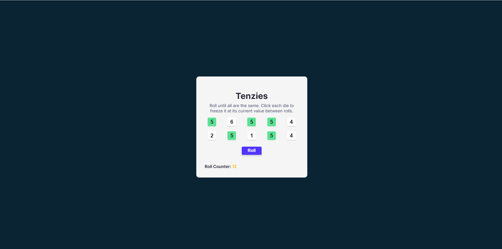

# 🎲 Tenzies Game – Built with React

This is a functional implementation of the classic **Tenzies** dice game, developed entirely with **React**. The goal of the game is to freeze all dice on the same value. You can click to "hold" individual dice, and roll the rest until you match them all—or reach the roll limit.

---

## 🚀 Features

- 🎲 Ten independently managed dice with synchronized state
- 🧊 Ability to "hold" dice between rolls
- 🔁 Roll button to reroll only the unheld dice
- 🟢🟡🔴 Color-coded roll counter (green, yellow, red) for performance feedback
- 🎉 Confetti animation upon winning
- ❌ Game over logic when exceeding the roll limit
- ♿️ Accessibility support via `aria-live`, `aria-label`, `aria-pressed`, and `useRef` for focus control
- 🔁 Fully resettable game state

---

## 📚 What I Learned (React Concepts)

This project is not just about making a game—it's a practical demonstration of key **React fundamentals and best practices**:

### 🧠 1. **State Derivation and Synchronization**
I used a **single source of truth** via the `dice` array state in `App.jsx`, where each die object contains `id`, `value`, and `isHeld`. By lifting state up and passing down props like `id` and `holdFunction`, I ensured all dice are managed centrally and stay in sync.

> ❗ I intentionally avoided managing state individually per `<Die />`, which would have led to desynchronized behavior and broken win/loss logic.

### 🎯 2. **Controlled Side Effects with `useEffect`**
I used `useEffect` to:
- Detect win conditions (all dice held and same value)
- Trigger confetti animations (external to React's control)
- Track loss condition when roll count exceeds the limit

This helped me understand when and why React needs help handling side effects.

### 🧭 3. **Focus Management and Accessibility with `useRef`**
Using `useRef`, I set focus programmatically on the “New Game” button after a win or loss to improve accessibility and keyboard navigation.

### 🎛️ 4. **Event Handling in JSX**
Through event listeners like `onClick`, I practiced the difference between:
- `onClick={myFunction}` (reference)
- `onClick={() => myFunction(args)}` (execution wrapper)

This is essential to avoid premature function calls during rendering.

### 🧱 5. **Component-Driven Architecture**
The app is split into:
- `App.jsx` — Controls game logic, state, and rendering
- `Die.jsx` — A reusable, focused component for each die with visual states (`held` / `not held`)

### 🎨 6. **Conditional Rendering and Visual Feedback**
I handled UI changes based on state:
- Showing "New Game" or "Roll" button conditionally
- Displaying different counters and messages for win/loss
- Accessibility hints using `aria-live` for screen readers

### 🧼 7. **Code Readability and Documentation**
All files are **fully documented** with clear explanations and sectioned logic. The goal is to demonstrate not just what I built—but *how I think*.

---

## 🖥️ Demo



---

## 🛠️ Technologies Used

- React (Functional Components + Hooks)
- `canvas-confetti` for celebration animation
- Pure CSS (custom styles, responsive layout)
- ARIA attributes and semantic HTML

---

## 🕹️ Game Rules

- Start with 10 dice, each showing a random number (1–6)
- Click a die to "hold" it (freeze its value)
- Click “Roll” to reroll all **unheld** dice
- 🎯 Win if all dice are held and show the same number
- ❌ Lose if you reach 25 rolls without winning

---

## 🧪 How to Run Locally

```bash
git clone https://github.com/your-username/tenzies-react.git
cd tenzies-react
npm install
npm run dev
